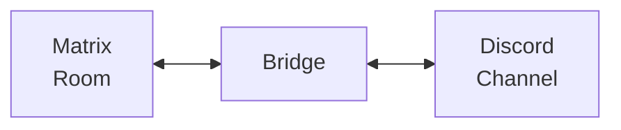

# Matrix Bridges

Bridges let you connect Matrix to other messaging platforms, creating a unified communication experience. This is one of Matrix's killer features - chat with anyone regardless of what app they use.

## What is a Bridge?

A bridge is a program that connects Matrix rooms to external services:



Messages flow both ways - Matrix users see Discord messages and vice versa.

## 2025 Bridge Ecosystem

The mautrix bridge family is the most actively maintained set of bridges:

| Update | Description |
|--------|-------------|
| **Calendar versioning** | Go bridges now use `vYY.0M.patch` format |
| **Signal backfill** | History transfer from phone on login |
| **mautrix-meta** | Unified Instagram + Messenger bridge |
| **E2EE stable** | End-to-bridge encryption production-ready |
| **MSC4153 support** | Cross-signing for bridge bots |
| **Matrix v12 rooms** | Full support in Hookshot and mautrix bridges |
| **bridgev2 framework** | New unified architecture for Go bridges |
| **mautrix-zulip** | New Zulip bridge with thread support |
| **mautrix-irc** | New IRC bridge replacing Heisenbridge |
| **DMA progress** | WhatsApp interoperability moving forward |

## Bridge Types

### Puppeting Bridges

**Best experience** - Each user appears as themselves on both sides.

```
Matrix User Alice  →  [Bridge]  →  Discord user "Alice (Matrix)"
Discord User Bob   →  [Bridge]  →  Matrix user @discord_bob:server
```

Features:
- Individual user accounts on each side
- Reactions, edits, replies work
- Typing indicators sync
- Read receipts sync

### Double Puppeting (Recommended)

**The holy grail of bridging** - Your Matrix identity is linked to your remote identity. Messages you send from the native app appear from your real Matrix account.

```
You on Discord app  →  [Bridge knows it's you]  →  Your Matrix account sends
You on Matrix       →  [Bridge]                 →  Your Discord account sends
```

**Benefits:**
- Messages from native apps bridge to Matrix as you (not a ghost)
- Auto-accept invites to new chats
- Sync mute status, favorites, read state
- DMs you send from phone appear on Matrix

**Setup methods:**
1. **Appservice double puppeting** - Admin configures for all users (recommended)
2. **Shared secret** - Server-wide configuration
3. **Manual login** - Each user provides access token

```yaml title="config.yaml (admin setup)"
double_puppet_server_map:
  example.com: https://matrix.example.com
login_shared_secret_map:
  example.com: "as_token:your-appservice-token"
```

### Relay Bridges

**Simpler setup** - Messages relayed through a bot.

```
Matrix User Alice  →  [Bridge Bot]  →  "Alice: Hello!" in Discord
```

Features:
- Single bot posts all messages
- Easier to set up
- No user authentication needed
- Less realistic user experience

**When to use relay mode:**
- Public community bridging
- Users who don't want to link accounts
- Platforms where puppeting isn't possible

### Portal vs Plumbed Rooms

| Type | Description | Use Case |
|------|-------------|----------|
| **Portal** | Auto-created room for each remote channel | Personal use, 1:1 mapping |
| **Plumbed** | Existing Matrix room connected to remote | Communities, custom setup |

## Popular Bridges

| Platform | Bridge | Puppeting | E2EE | Status | Notes |
|----------|--------|-----------|------|--------|-------|
| [Discord](./discord) | mautrix-discord | ✅ | ✅ | Stable | QR or token login |
| [Telegram](./telegram) | mautrix-telegram | ✅ | ✅ | Stable | Relay + puppet modes |
| [Slack](./slack) | matrix-appservice-slack | ✅ | ✅ | Stable | OAuth or token |
| [IRC](./irc) | Heisenbridge | Bouncer | ❌ | Stable | Per-user connections |
| [IRC](./irc) | mautrix-irc | ✅ | ✅ | **New** | bridgev2 framework |
| [Signal](./signal) | mautrix-signal | ✅ | ✅ | Stable | **NEW:** History backfill |
| [WhatsApp](./whatsapp) | mautrix-whatsapp | ✅ | ✅ | Stable | Multi-device API |
| Instagram | mautrix-meta | ✅ | ✅ | Stable | **Replaces mautrix-instagram** |
| Messenger | mautrix-meta | ✅ | ✅ | Stable | **Replaces mautrix-facebook** |
| iMessage | mautrix-imessage | ✅ | ✅ | Stable | Requires Mac/iPhone |
| Google Chat | mautrix-googlechat | ✅ | ✅ | Stable | Workspace accounts |
| LinkedIn | beeper-linkedin | ✅ | ✅ | Beta | Based on mautrix-python |
| Twitter/X | mautrix-twitter | ✅ | ✅ | Stable | DMs only |
| Zulip | mautrix-zulip | ✅ | ✅ | **New** | Topics → threads |
| Bluesky | (in progress) | - | - | Exploratory | Community efforts |

### Bridge Version Format (2025)

Go-based mautrix bridges now use calendar versioning: `vYY.0M.patch`
- Example: `v25.01.2` = January 2025, patch 2
- Makes it easy to see how old a version is

## New Bridge Initiatives (2025)

### mautrix-zulip

A new bridge connecting Matrix to [Zulip](https://zulip.com/), the team chat platform.

**Key features:**
- Zulip **topics** map to Matrix **threads** (MSC3440)
- Full puppeting support
- E2EE support via bridgev2 framework
- Works with both Zulip Cloud and self-hosted

```yaml title="Basic config"
zulip:
  site: https://your-org.zulipchat.com
  email: bot-email@example.com
  api_key: your-bot-api-key
```

**Status:** New, part of the bridgev2 rewrite

### mautrix-irc (bridgev2)

A new IRC bridge built on the modern bridgev2 framework, designed to eventually replace Heisenbridge.

**Why a new IRC bridge?**
- **Unified architecture** - Same framework as other mautrix bridges
- **E2EE support** - Unlike Heisenbridge
- **Better maintenance** - Part of the mautrix ecosystem
- **Modern features** - Threads, reactions where possible

**Comparison:**

| Feature | Heisenbridge | mautrix-irc |
|---------|--------------|-------------|
| Framework | Standalone | bridgev2 |
| E2EE | ❌ | ✅ |
| Bouncer mode | ✅ | ✅ |
| Relay mode | ✅ | ✅ |
| Maintenance | Stable | Active development |

**Status:** Active development, not yet production-ready for all use cases

### DMA Interoperability

The EU Digital Markets Act (DMA) requires "gatekeepers" (Meta, Apple, Google) to enable interoperability with other messaging platforms. Matrix is a key player.

**WhatsApp → Matrix progress:**

| Aspect | Status |
|--------|--------|
| Protocol work | Active via Matrix.org Foundation |
| Geographic availability | EU only (initially) |
| User opt-in | Required on both sides |
| E2EE | Must be maintained |
| Feature parity | Basic messaging first |

**What this means:**
- Official WhatsApp interoperability (beyond the mautrix bridge)
- Users must explicitly opt-in to third-party messaging
- Initially EU residents only
- Basic text messaging first, media/calls later

**Timeline:**
- DMA compliance deadline: March 2024
- WhatsApp announced interop plans: 2024
- Full rollout: Gradual through 2025-2026

:::info DMA vs mautrix-whatsapp
DMA interoperability is **official** Meta support. mautrix-whatsapp uses the unofficial multi-device API. Both can coexist - mautrix gives you more control today.
:::

### Bluesky Bridge

Community exploration of bridging Matrix to Bluesky (AT Protocol).

**Challenges:**
- Bluesky is public-first (like Twitter), not private DMs
- Different model: posts vs chat messages
- AT Protocol identity system differs from Matrix

**Current approaches:**
- **Post mirroring** - Public Matrix rooms mirror Bluesky feeds
- **Bot integration** - Bots that post/reply across platforms
- **Full bridge** - Not yet viable for DMs

**Status:** Exploratory, community-driven projects. No official mautrix bridge yet.

### bridgev2 Framework

The next generation architecture for mautrix Go bridges. Being adopted by all new bridges.

**What's different:**
- Unified connector interface
- Better state management
- Simplified configuration
- Improved logging/metrics
- Easier to add new networks

**Bridges using bridgev2:**
- mautrix-signal (ported)
- mautrix-whatsapp (ported)
- mautrix-discord (porting)
- mautrix-irc (new)
- mautrix-zulip (new)

## Hosted Bridge Services

Don't want to self-host? These services provide managed bridges:

| Service | Bridges | Pricing |
|---------|---------|---------|
| [Beeper](https://beeper.com) | All major | Subscription |
| [etke.cc](https://etke.cc) | Most | Per-bridge |
| [Element EMS](https://element.io/ems) | Enterprise | Contact |

## Self-Hosting Bridges

### Requirements

Most mautrix bridges need:
- Homeserver with appservice support (Synapse, Dendrite)
- Python 3.8+ or pre-built Docker images
- Registration file configured

### General Setup Pattern

```bash
# 1. Clone bridge repository
git clone https://github.com/mautrix/discord.git
cd discord

# 2. Create config
cp example-config.yaml config.yaml

# 3. Edit config (homeserver, appservice details)
nano config.yaml

# 4. Generate registration
python -m mautrix_discord -g

# 5. Add registration to homeserver config
# (homeserver.yaml for Synapse)

# 6. Restart homeserver

# 7. Start bridge
python -m mautrix_discord
```

### Docker Deployment

```yaml title="docker-compose.yml"
version: '3'
services:
  mautrix-discord:
    image: dock.mau.dev/mautrix/discord:latest
    restart: unless-stopped
    volumes:
      - ./discord-data:/data
    depends_on:
      - synapse
```

## Bridge Configuration

### Appservice Registration

Bridges register as "appservices" with your homeserver:

```yaml title="registration.yaml"
id: discord
url: http://localhost:29334
as_token: <generated>
hs_token: <generated>
sender_localpart: discordbot
rate_limited: false
namespaces:
  users:
    - exclusive: true
      regex: '@discord_.*:example\.com'
  aliases:
    - exclusive: true
      regex: '#discord_.*:example\.com'
```

Add to Synapse config:
```yaml title="homeserver.yaml"
app_service_config_files:
  - /data/discord-registration.yaml
```

## End-to-Bridge Encryption

Many bridges support encryption on the Matrix side. This is now **stable for production use** (2025).

### What It Means

```
┌─────────────┐      E2EE      ┌──────────┐    Decrypted   ┌─────────────┐
│   Matrix    │◄──────────────►│  Bridge  │◄──────────────►│  Discord    │
│   Client    │   (encrypted)  │          │  (plaintext)   │  Server     │
└─────────────┘                └──────────┘                └─────────────┘
```

- **Matrix side**: Messages encrypted, only bridge can decrypt
- **Remote side**: Messages in plaintext (platform's native format)
- **You must trust**: The bridge server and its security

### Configuration

```yaml title="config.yaml"
encryption:
  allow: true      # Work in encrypted rooms
  default: true    # Auto-enable encryption in new portals
  require: false   # Only work in encrypted rooms

  # For MAS (Matrix Authentication Service) users:
  msc4190: true
```

### Requirements

**Python bridges:**
```bash
pip install mautrix[e2be]
```

**Go bridges:** Docker images include encryption support. Manual builds need libolm.

### Cross-Signing (MSC4153)

Bridges can now cross-sign themselves for future-proofing:

```yaml
encryption:
  self_sign: true  # Bridge generates recovery key and signs itself
```

:::warning
End-to-bridge encryption ≠ end-to-end encryption. The bridge decrypts messages to send them to Discord/WhatsApp/etc. Trust your bridge operator.
:::

## Bridge Management

### Common Commands

Most mautrix bridges respond to commands in DMs:

```
!help                    - Show all commands
!login                   - Start login process
!logout                  - Disconnect account
!sync                    - Sync contacts/groups
!ping                    - Test bridge connection
```

### Admin Commands

Bridge admins can use:
```
!admin list-users       - List bridged users
!admin set-relay        - Configure relay mode
!admin set-permissions  - Manage permissions
```

## Performance Considerations

### Resource Usage

| Bridge | RAM (idle) | Notes |
|--------|-----------|-------|
| mautrix-discord | 50-100 MB | Per account |
| mautrix-telegram | 50-100 MB | Per account |
| mautrix-whatsapp | 100-200 MB | Includes crypto |
| Heisenbridge | 30-50 MB | Very lightweight |

### Scaling

For many users:
- Run bridges on separate servers
- Use PostgreSQL instead of SQLite
- Consider multiple bridge instances

## Best Practices

### Security

1. **Use separate accounts** for bridging
2. **Enable E2EE** on Matrix side when possible
3. **Review permissions** bridges request
4. **Keep bridges updated** for security fixes

### Reliability

1. **Monitor bridge health** via metrics/logs
2. **Set up restart policies** (systemd, Docker)
3. **Back up bridge databases**
4. **Test failover** procedures

### User Experience

1. **Document for users** how bridges work
2. **Set expectations** about features/limitations
3. **Create support channels** for bridge issues

## Troubleshooting

### Bridge Not Starting

```bash
# Check logs
journalctl -u mautrix-discord -f
# or
docker logs mautrix-discord -f

# Verify registration
cat registration.yaml

# Test homeserver connectivity
curl http://localhost:8008/_matrix/client/versions
```

### Homeserver Not Sending Events

If inviting the bot doesn't work and logs show nothing:

1. **Check appservice address** - Can homeserver reach the bridge?
2. **Grep for "transactions"** in homeserver logs
3. **Verify registration file** is in homeserver config
4. **Restart homeserver** after adding registration

### Messages Not Syncing

1. Check bridge logs for errors
2. Verify remote platform auth: `!bridge ping`
3. Test with simple text message
4. Check rate limits on remote platform

### Encryption Not Working

**"Bridge has not been configured to support encryption"**

1. Verify `encryption.allow: true` in config
2. Check bridge has libolm (Go) or e2be deps (Python)
3. Don't use "never send to unverified" client setting
4. Try `/discardsession` in Element and resend

**Force-enabled encryption:**
- Server-side encryption enable doesn't notify bridge
- Bridge must enable encryption itself
- Set `appservice: true` with Synapse 1.141+

**MSC4190 (MAS users):**
```yaml
encryption:
  msc4190: true  # Required for Matrix Authentication Service
```

### Double Bridging

If messages appear twice:
- Check for multiple bridge instances
- Verify room isn't bridged twice
- Review bot permissions

### Backfill Not Working

Matrix can't insert messages into history - backfill only works in empty rooms:
- Configure backfill settings **before** first login
- Missed message backfill (after re-login) should work if no new messages sent

### Read Receipts / Typing Not Syncing

Bridges use MSC2409 for ephemeral events:
- Only supported in Synapse currently
- Check `ephemeral_events: true` in registration
- Update bridge config if using old instance

## Resources

### Official
- [mautrix bridges](https://github.com/mautrix) - Main bridge repositories
- [mautrix documentation](https://docs.mau.fi/bridges/) - Comprehensive setup guides
- [Matrix.org bridges](https://matrix.org/ecosystem/bridges/) - Official bridge listing

### Community
- [#bridges:matrix.org](https://matrix.to/#/#bridges:matrix.org) - General bridge discussion
- [#mautrix:maunium.net](https://matrix.to/#/#mautrix:maunium.net) - mautrix bridge support
- [#heisenbridge:vi.fi](https://matrix.to/#/#heisenbridge:vi.fi) - IRC bridge support

### DMA/Interoperability
- [Matrix.org DMA updates](https://matrix.org/blog/category/dma/) - Official DMA progress
- [MIMI working group](https://datatracker.ietf.org/wg/mimi/about/) - IETF interoperability work

## Next Steps

Choose a bridge to set up:
- [Discord Bridge](./discord)
- [Telegram Bridge](./telegram)
- [Slack Bridge](./slack)
- [IRC Bridge](./irc)
- [Signal Bridge](./signal)
- [WhatsApp Bridge](./whatsapp)

### Experimental
- [Solid & WebID Integration](./solid) - Decentralized identity and chat archives

---

*Last updated: January 2025*
