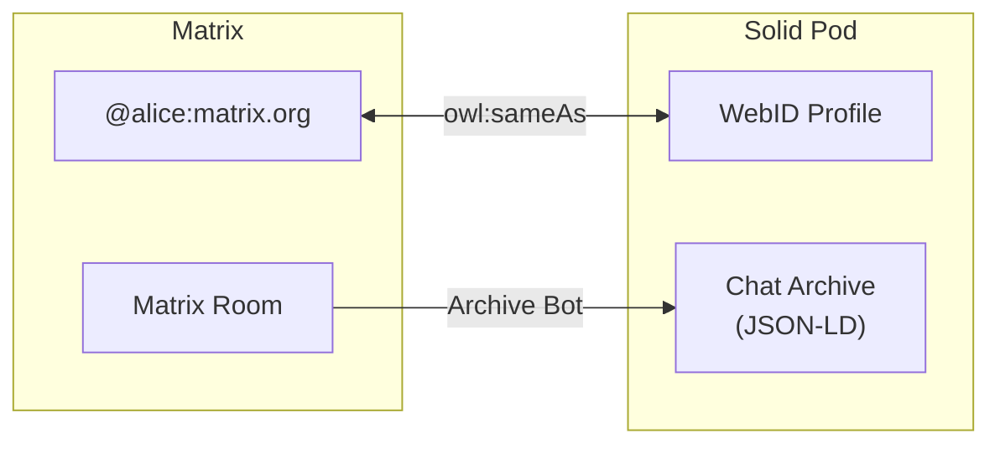
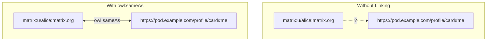
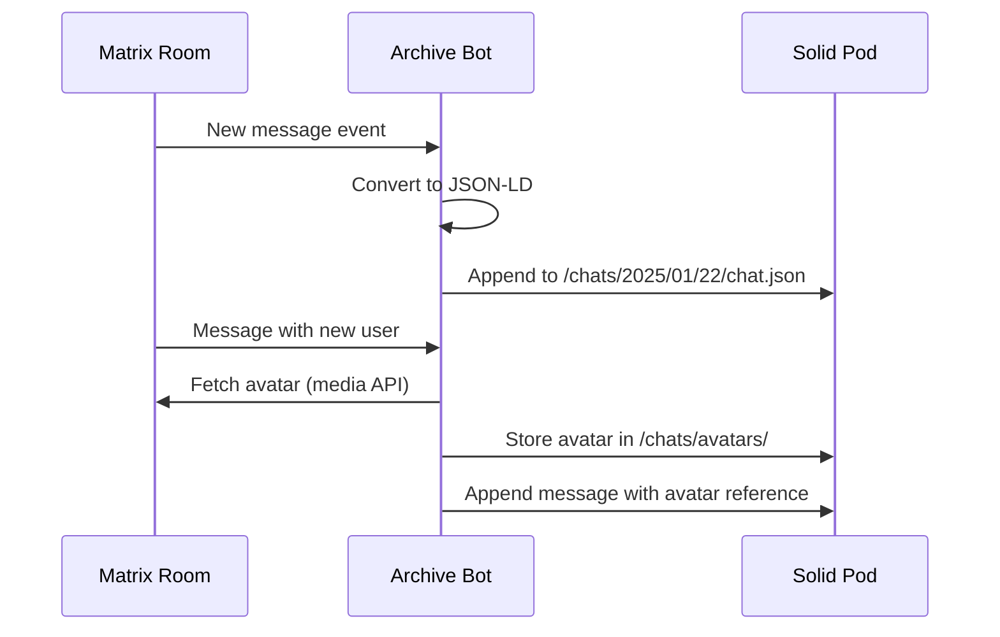
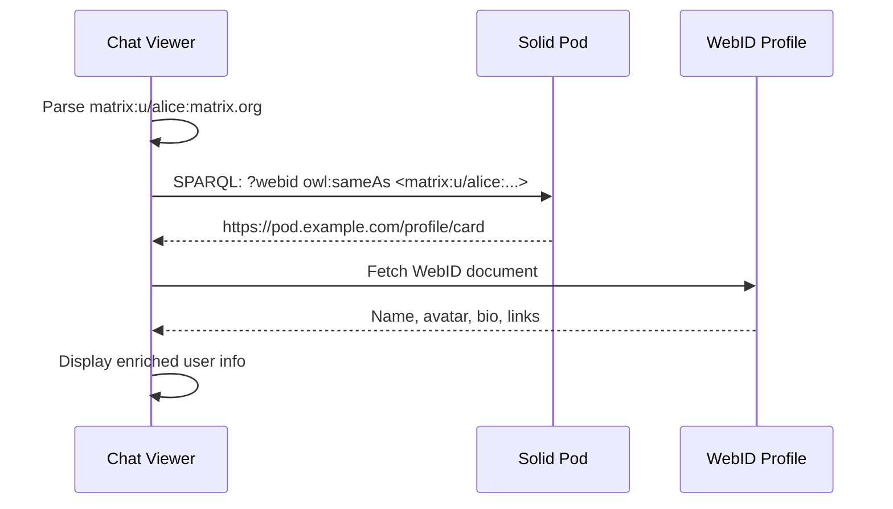
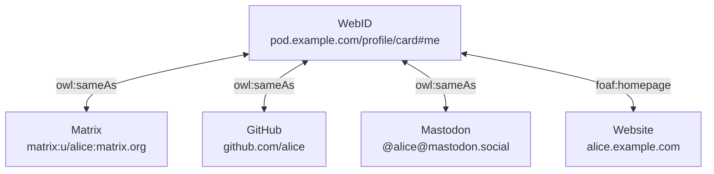

# Solid & WebID Integration

Connect Matrix to the decentralized web. Link your Matrix identity to a WebID and archive chat history to Solid pods as Linked Data.

:::info Experimental
This integration is experimental and community-driven. Standards are still being developed.
:::

## What is This?

This page covers two related concepts:

| Concept | Description |
|---------|-------------|
| **WebID-Matrix linking** | Declare that your Matrix ID and WebID are the same person |
| **Solid chat archives** | Store Matrix messages as JSON-LD on a Solid pod |

Together, these enable **decentralized identity** and **data ownership** for Matrix users.



## Background

### What is WebID?

A [WebID](https://www.w3.org/wiki/WebID) is a decentralized identifier - a URL that points to your profile document. Unlike centralized accounts, you control your WebID.

```
https://pod.example.com/profile/card#me
```

Your WebID profile can contain:
- Name, avatar, bio
- Links to other identities (Matrix, GitHub, etc.)
- Public keys for authentication
- Social connections

### What is Solid?

[Solid](https://solidproject.org/) (Social Linked Data) is a specification for personal data pods. You store your data on your pod and grant apps permission to access it.

Key features:
- **Data ownership** - You control your data
- **Interoperability** - Apps use standard vocabularies
- **Decentralization** - Choose your pod provider or self-host

### Why Link Matrix to WebID?

| Benefit | Description |
|---------|-------------|
| **Unified identity** | One identity across Matrix, Solid, and the web |
| **Profile portability** | Use your Solid profile avatar/bio in Matrix contexts |
| **Data ownership** | Archive your chats to your own pod |
| **Semantic web** | Matrix data becomes queryable Linked Data |

## Matrix URI Scheme

Matrix has a standard URI scheme defined in [MSC2312](https://github.com/matrix-org/matrix-spec-proposals/pull/2312):

```
matrix:u/username:homeserver.org
```

Examples:
```
matrix:u/alice:matrix.org
matrix:u/bob:example.com
matrix:r/myroom:matrix.org      (rooms)
matrix:roomid/!abc123:matrix.org (room by ID)
```

This URI scheme enables Matrix identities to be used in Linked Data contexts - you can reference a Matrix user just like any other web resource.

## Linking WebID to Matrix

### The Identity Problem

Matrix identities (`@alice:matrix.org`) and WebIDs (`https://alice.example.com/profile/card#me`) are separate systems. To enable cross-platform features, we need to declare they represent the same person.



### Adding to Your WebID Profile

Add a triple to your WebID profile document linking your Matrix identity:

```turtle title="profile/card.ttl"
@prefix owl: <http://www.w3.org/2002/07/owl#> .
@prefix foaf: <http://xmlns.com/foaf/0.1/> .

<#me>
    a foaf:Person ;
    foaf:name "Alice" ;
    owl:sameAs <matrix:u/alice:matrix.org> .
```

### Predicate Options

The linking predicate is not yet standardized. Options include:

| Predicate | Meaning | Strength |
|-----------|---------|----------|
| `owl:sameAs` | These identities are equivalent | Strong |
| `foaf:account` | This is an account I control | Medium |
| `schema:sameAs` | Schema.org equivalence | Strong |
| `foaf:holdsAccount` | I hold this online account | Medium |

**Recommendation:** Use `owl:sameAs` for now, as it's the most widely understood equivalence predicate.

### Example Profile

```turtle title="Complete WebID profile with Matrix link"
@prefix foaf: <http://xmlns.com/foaf/0.1/> .
@prefix owl: <http://www.w3.org/2002/07/owl#> .
@prefix solid: <http://www.w3.org/ns/solid/terms#> .

<#me>
    a foaf:Person ;
    foaf:name "Alice Developer" ;
    foaf:nick "alice" ;
    foaf:img <https://pod.example.com/profile/avatar.png> ;

    # Matrix identity
    owl:sameAs <matrix:u/alice:matrix.org> ;

    # Other identities
    owl:sameAs <https://github.com/alice> ;

    # Solid pod
    solid:oidcIssuer <https://solidcommunity.net> .
```

## Chat Archives on Solid

Store Matrix chat history on a Solid pod as JSON-LD, enabling:
- Personal chat backups you control
- Semantic queries across your conversations
- Integration with other Linked Data applications

### Message Format

Messages are stored using standard vocabularies:

```json title="2025/01/22/chat.json"
{
  "@context": {
    "foaf": "http://xmlns.com/foaf/0.1/",
    "sioc": "http://rdfs.org/sioc/ns#",
    "dct": "http://purl.org/dc/terms/",
    "meeting": "http://www.w3.org/ns/pim/meeting#"
  },
  "@type": "meeting:message",
  "dct:created": "2025-01-22T14:30:00Z",
  "sioc:content": "Hello, world!",
  "foaf:maker": {
    "@id": "matrix:u/alice:matrix.org",
    "@type": "foaf:Person",
    "foaf:name": "Alice",
    "foaf:nick": "@alice:matrix.org",
    "foaf:img": {
      "@id": "https://pod.example.com/chats/avatars/alice.png"
    }
  }
}
```

:::tip When to use @graph
Use `@graph` only when storing multiple messages in one file. For a single message, it's not needed.
:::

### Directory Structure

Date-sharded for efficient access:

```
/public/chats/matrix-room-name/
├── 2025/
│   ├── 01/
│   │   ├── 20/
│   │   │   └── chat.json
│   │   ├── 21/
│   │   │   └── chat.json
│   │   └── 22/
│   │       └── chat.json
│   └── ...
├── avatars/
│   ├── alice_matrix.org.png
│   └── bob_example.com.png
└── index.json
```

### Vocabularies Used

| Vocabulary | Prefix | Usage |
|------------|--------|-------|
| [FOAF](http://xmlns.com/foaf/0.1/) | `foaf:` | Person, name, avatar |
| [SIOC](http://rdfs.org/sioc/ns#) | `sioc:` | Content, forum, post |
| [Dublin Core](http://purl.org/dc/terms/) | `dct:` | Created, modified dates |
| [Meeting](http://www.w3.org/ns/pim/meeting#) | `meeting:` | Chat messages |

### Avatar Handling

Matrix media URLs require authentication, so bridges typically:

1. Download avatars from Matrix media API
2. Store on Solid pod (public or authenticated)
3. Reference the pod URL in JSON-LD

```json
"foaf:img": {
  "@id": "https://pod.example.com/chats/avatars/_alice_matrix.org.png"
}
```

## Implementation Approaches

### Bot-Based Archive

A Matrix bot joins rooms and archives messages to a Solid pod:



The bot:
1. Listens for new messages
2. Converts to JSON-LD format
3. Appends to daily chat file
4. Downloads and caches avatars

### Client-Side Export

Matrix clients could export history directly to Solid:

1. User authenticates to Solid pod
2. Client exports room history
3. Converts to JSON-LD
4. Uploads to pod

### WebID Profile Lookup

Chat viewers can enrich Matrix identities:



## Discovery Mechanisms

### From Matrix to WebID

How does a client find the WebID for a Matrix user?

**Option 1: Query known pods**
```sparql
SELECT ?webid WHERE {
  ?webid owl:sameAs <matrix:u/alice:matrix.org> .
}
```

**Option 2: Matrix profile field**
Add WebID to Matrix profile (custom field or future MSC)

**Option 3: Well-known endpoint**
`https://matrix.org/.well-known/webid/@alice:matrix.org`

### From WebID to Matrix

Easy - just parse the `owl:sameAs` triple from the WebID profile.

## Use Cases

### Decentralized Profiles

Display Solid profile info for Matrix users:
- Richer bios than Matrix allows
- Verified links to other platforms
- Professional information

### Chat Data Ownership

Users own their conversation history:
- Export from any Matrix server
- Import into any Solid-compatible app
- Query across all your chats

### Cross-Platform Identity

One identity across multiple platforms:



### Semantic Queries

Query your chat history with SPARQL:

```sparql
# Find all messages mentioning "project"
SELECT ?date ?content ?author WHERE {
  ?msg a meeting:message ;
       dct:created ?date ;
       sioc:content ?content ;
       foaf:maker/foaf:name ?author .
  FILTER(CONTAINS(?content, "project"))
}
ORDER BY DESC(?date)
```

## Open Questions

These areas need community input and standardization:

### 1. Predicate Standardization

Which predicate should link Matrix IDs to WebIDs?
- `owl:sameAs` is strong but may be too strong
- `foaf:account` is weaker but well-understood
- A new `matrix:webId` predicate?

### 2. Bidirectional Linking

Should the link exist on both sides?
- WebID profile → Matrix ID (easy, user controls)
- Matrix profile → WebID (needs spec work)

### 3. Verification

How do we verify someone controls both identities?
- Sign a challenge with Matrix device keys?
- Post verification on both platforms?
- Trust the WebID profile owner?

### 4. Discovery

How do clients discover WebID ↔ Matrix links?
- Centralized index?
- Decentralized queries?
- Matrix profile extension?

### 5. Privacy

Linking identities has privacy implications:
- Public WebID reveals Matrix identity
- Should linking be opt-in and revocable?

## Getting Involved

### Community

- [#solid:matrix.org](https://matrix.to/#/#solid:matrix.org) - Solid + Matrix discussion
- [Solid Forum](https://forum.solidproject.org/) - Solid community
- [Matrix Spec Proposals](https://github.com/matrix-org/matrix-spec-proposals) - Propose MSCs

### Specifications

- [WebID Spec](https://www.w3.org/wiki/WebID)
- [Solid Protocol](https://solidproject.org/TR/protocol)
- [MSC2312 - Matrix URI Scheme](https://github.com/matrix-org/matrix-spec-proposals/pull/2312)
- [JSON-LD](https://json-ld.org/)

### Related Projects

- [Solid Project](https://solidproject.org/)
- [ActivityPub](https://www.w3.org/TR/activitypub/) - Federated social
- [DID (Decentralized Identifiers)](https://www.w3.org/TR/did-core/)

---

*This page documents experimental community work. Contributions welcome!*
